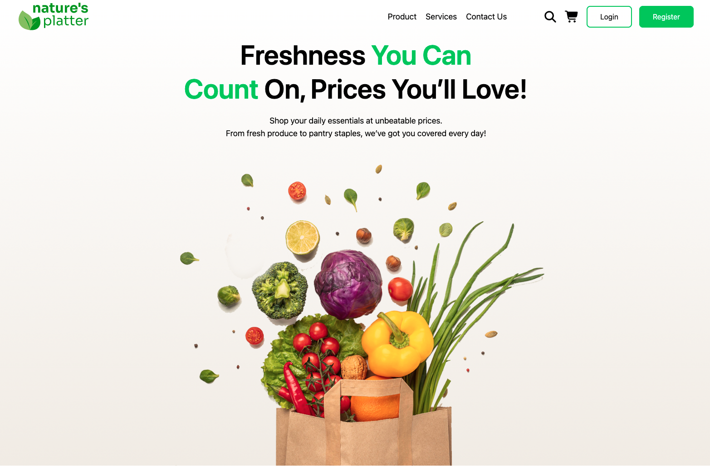

# 🥬 Nature's Platter — Grocery Store Landing Page

A modern and responsive grocery store landing page built with **HTML5 and Tailwind CSS**.

The project focuses on creating a clean and user-friendly grocery shopping experience with a modern hero section, service highlights, product cards, promotional offers, newsletter subscription, and responsive layouts.

## 🌐 Live Demo

**[View Live Website](https://almamuncode.github.io/nature-s-platter/)**

---

## 📸 Preview



---

## ✨ Features

- Responsive navigation bar
- Hero section with grocery shopping CTA
- Product, Services, and Contact navigation
- Login and Register buttons
- Search and shopping cart interface
- Services section
  - 24/7 Services
  - Fast Delivery
  - Healthy Products
- Popular products section
- Product cards with ratings and pricing
- Promotional discount section
- New arrivals and special offers
- Newsletter subscription section
- Responsive footer
- Responsive layout for desktop, tablet, and mobile devices
- Modern grocery-focused visual design

---

## 🛠️ Technologies Used

- **HTML5** — Semantic page structure
- **Tailwind CSS** — Utility-first styling and responsive layouts
- **DaisyUI** — UI components and design utilities
- **Figma** — UI design and layout planning
- **Git & GitHub** — Version control and project hosting
- **GitHub Pages** — Deployment

> Tailwind CSS is loaded through the Tailwind CSS browser CDN. No npm package installation is required to run this project.

---

## 📂 Project Structure

```text
nature-s-platter/
│
├── assets/
│   ├── nav-logo.png
│   ├── Hero Section 1.png
│   ├── search.svg
│   ├── cart.svg
│   ├── service.png
│   ├── delivery.png
│   ├── products.png
│   ├── popular.png
│   ├── onion.png
│   ├── dawat-logo.png
│   ├── gate-logo.png
│   ├── offers-1.png
│   ├── offers-2.png
│   ├── grocery-basket.png
│   └── ...
│
├── index.html
├── tailwindinit.css
├── Nature's Platter.fig
└── README.md
```

---

## 🚀 Getting Started

### 1. Clone the repository

```bash
git clone https://github.com/almamuncode/nature-s-platter.git
```

### 2. Navigate to the project

```bash
cd nature-s-platter
```

### 3. Open the project

This is a static HTML project, so no package installation is required.

You can open `index.html` directly in your browser.

For a better development experience, use **VS Code with Live Server** or another local development server.

---

## 💻 Run with VS Code Live Server

1. Open the project in VS Code.
2. Install the **Live Server** extension.
3. Right-click `index.html`.
4. Select **Open with Live Server**.

The project will open in your browser.

---

## 📱 Responsive Design

The website is designed to provide a responsive experience across:

- Desktop
- Laptop
- Tablet
- Mobile devices

Tailwind CSS responsive utilities are used to adapt navigation, grids, cards, typography, spacing, and layouts according to screen size.

---

## 🎨 Design & Development

The project was developed from a grocery store UI design and implemented using semantic HTML5 and Tailwind CSS.

Special attention was given to:

- Visual hierarchy
- Typography
- Spacing
- Responsive layouts
- Flexbox and Grid layouts
- Product card design
- Promotional sections
- Call-to-action placement
- Consistent color usage
- Mobile responsiveness

The project also includes the original **Figma design file** used during the design process.

---

## 🧩 Main Sections

### 🏠 Hero Section

Introduces Nature's Platter with a grocery shopping message and a visually engaging hero image.

### 🛎️ Services

Highlights the main services offered:

- 24/7 Services
- Fast Delivery
- Healthy Products

### 🛒 Popular Products

Displays grocery products with:

- Product images
- Ratings
- Product names
- Pricing

### 🎁 Arrival & Offers

Promotional sections showcasing special offers and discounts of up to **20%** and **40%**.

### 📧 Grocery Newsletter

A newsletter subscription section allowing visitors to enter their email address and receive grocery-related updates and offers.

### 🔗 Footer

Contains:

- Brand information
- Navigation links
- Social media links
- Additional website information

---

## 📦 Dependencies

This project does not require npm or a package manager.

### Tailwind CSS

Tailwind CSS is loaded directly in `index.html` using the browser CDN:

```html
<script src="https://cdn.jsdelivr.net/npm/@tailwindcss/browser@4"></script>
```

### Other Dependencies

- No JavaScript framework
- No npm packages
- No backend
- No database

The project runs entirely as a static frontend website.

---

## 🚀 Deployment

The website is deployed using **GitHub Pages**.

### Live Website

**[https://almamuncode.github.io/nature-s-platter/](https://almamuncode.github.io/nature-s-platter/)**

---

## 📚 What I Learned

Through this project, I practiced:

- Writing semantic HTML
- Using Tailwind CSS utility classes
- Building responsive layouts
- Working with CSS Grid and Flexbox
- Creating reusable product cards
- Building responsive navigation
- Creating promotional sections
- Managing image assets
- Working with Figma designs
- Using Git and GitHub effectively
- Deploying static websites with GitHub Pages

---

## 👨‍💻 Author

**Md Al Mamun**

Junior Developer with a professional background in graphic and UI design.

- Portfolio: [almamuncool.com](https://www.almamuncool.com)
- GitHub: [@almamuncode](https://github.com/almamuncode)

---

## 📄 License

This project was created for educational and portfolio purposes.
